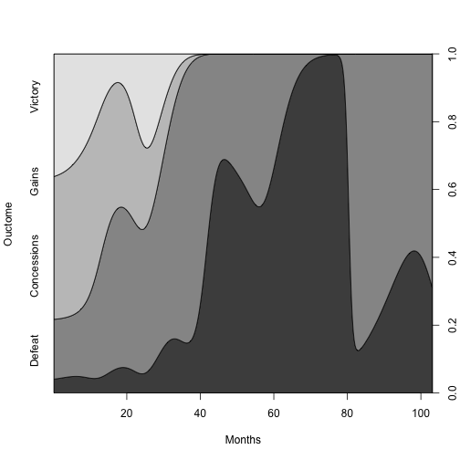

---

```r
cdplot(war$outcome~war$months, ylab="Ouctome",xlab="Months")
```


---


---
Ordered Logit


```r
summary(m <- polr(outcome ~ months, data = war, Hess=TRUE, method="logistic"))
```

```
## Call:
## polr(formula = outcome ~ months, data = war, Hess = TRUE, method = "logistic")
## 
## Coefficients:
##          Value Std. Error t value
## months -0.0569     0.0123  -4.625
## 
## Intercepts:
##                    Value   Std. Error t value
## Defeat|Concessions -3.5068  0.5017    -6.9902
## Concessions|Gains  -1.1854  0.2652    -4.4704
## Gains|Victory       0.5950  0.2507     2.3736
## 
## Residual Deviance: 241.5932 
## AIC: 249.5932
```
---

---
Ordered Probit


```r
summary(m <- polr(outcome ~ months, data = war, Hess=TRUE, method="probit"))
```

```
## Call:
## polr(formula = outcome ~ months, data = war, Hess = TRUE, method = "probit")
## 
## Coefficients:
##          Value Std. Error t value
## months -0.0309   0.005921  -5.219
## 
## Intercepts:
##                    Value   Std. Error t value
## Defeat|Concessions -1.9521  0.2385    -8.1831
## Concessions|Gains  -0.6894  0.1529    -4.5081
## Gains|Victory       0.3919  0.1478     2.6512
## 
## Residual Deviance: 242.5481 
## AIC: 250.5481
```
---

---

```r
m.pred <- predict(m, type="probs")
summary(m.pred)
```

```
##      Defeat         Concessions         Gains             Victory         
##  Min.   :0.02553   Min.   :0.1014   Min.   :0.006004   Min.   :0.0001696  
##  1st Qu.:0.02798   1st Qu.:0.2288   1st Qu.:0.386068   1st Qu.:0.1803858  
##  Median :0.03766   Median :0.2582   Median :0.408135   Median :0.2858866  
##  Mean   :0.09901   Mean   :0.2896   Mean   :0.367019   Mean   :0.2443940  
##  3rd Qu.:0.07635   3rd Qu.:0.3493   3rd Qu.:0.409897   3rd Qu.:0.3326705  
##  Max.   :0.89240   Max.   :0.4713   Max.   :0.411212   Max.   :0.3471999
```
---


---

```r
beta<-c(m$coefficients,m$zeta)
beta
```

```
##             months Defeat|Concessions  Concessions|Gains 
##        -0.03090493        -1.95206287        -0.68938970 
##      Gains|Victory 
##         0.39186099
```

```r
vcov(m)
```

```
##                          months Defeat|Concessions Concessions|Gains
## months             3.505898e-05       0.0008615297      0.0004415276
## Defeat|Concessions 8.615297e-04       0.0569047247      0.0182637080
## Concessions|Gains  4.415276e-04       0.0182637080      0.0233856026
## Gains|Victory      2.930095e-04       0.0103189452      0.0111882926
##                    Gains|Victory
## months              0.0002930095
## Defeat|Concessions  0.0103189452
## Concessions|Gains   0.0111882926
## Gains|Victory       0.0218462764
```
---

---

```r
library(MASS)
n.draws <- 1000
set.seed(123)
sim.coefs <- rmvnorm(n.draws, beta, vcov(m))
```
---


---

```r
n.obs <- length(war[[1]])
for(i in 1:n.draws){
  # For the current set of coefficients, calculate a
  # latent probability for all observations using observed values
  # first, set up vectors to store our linear predictors
  
 
  Xb.1 <- numeric(n.obs) # Cut point 1
  Xb.2 <- numeric(n.obs) # Cut point 2
  Xb.3  <- numeric(n.obs) # Cut point 3
  
  for(j in 1:n.obs){
  Xb.1[j] <- sim.coefs[i,2]*1+sim.coefs[i,1]*10 #Cutpoint 1 turned on
  Xb.2[j] <- sim.coefs[i,3]*1+sim.coefs[i,1]*10 #Cutpoint 2 turned on
  Xb.3[j] <- sim.coefs[i,4]*1+sim.coefs[i,1]*10 #Cubpoint 3 turned on
  }
```
---

---

```r
 #probability of being in category 1-4
  p1=plogis(Xb.1)
  p2=plogis(Xb.2)-plogis(Xb.1)
  p3=plogis(Xb.3)-plogis(Xb.2)
  p4=1-plogis(Xb.3)
 
   ####average probability across all observations####
  p.1[i]<-mean(p1)
  p.2[i]<-mean(p2)
  p.3[i]<-mean(p3)
  p.4[i]<-mean(p4)
}
```
---


